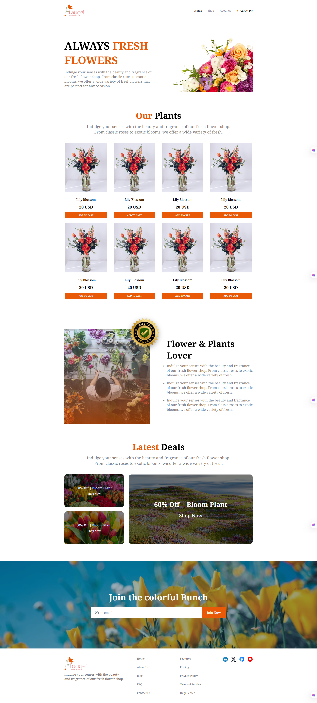
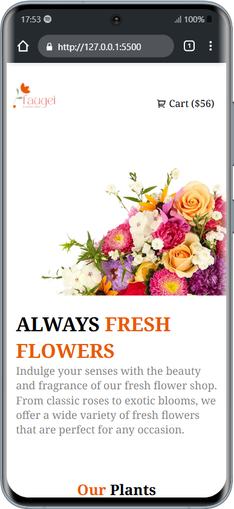
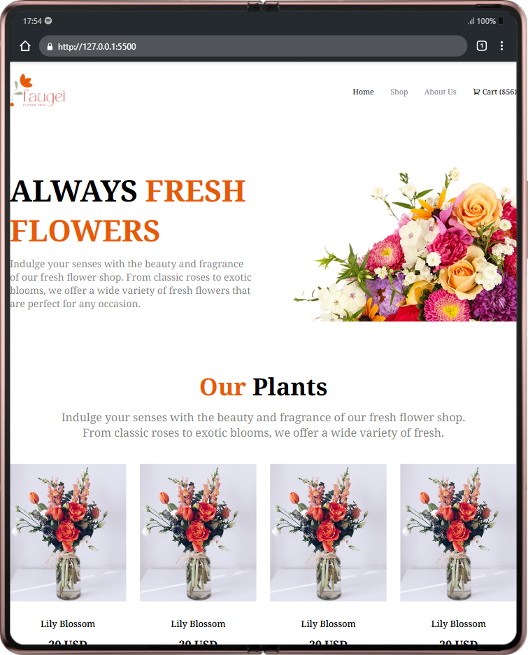

# 🌐 Assignment 02 - Responsive Website Project

[](https://github.com/Elias729/Assignment-02/stargazers)
[](https://github.com/Elias729/Assignment-02/network)

Welcome to **Assignment-02**, a simple and elegant HTML/CSS-based responsive website.  
This project was created as part of a frontend development learning journey.

## 🌐 Live Demo
[View the live site here »](https://elias729.github.io/influencer-gear/)

---

## 📸 Screenshots

### 🖥️ Desktop View


---

### 📱 Mobile View


---

### 💻 Tab View


---

## 📁 Project Overview

This project demonstrates the fundamentals of frontend web development using HTML and CSS.  
It showcases a static website structure with clean design and responsiveness optimized for all devices.

---

## ✨ Key Features

- ✅ Clean, semantic HTML5 structure  
- ✅ Responsive CSS layout (Mobile, Tablet & Desktop)  
- ✅ Smooth button hover effects  
- ✅ Organized sections: Home, Services, About, Contact  
- ✅ Beginner-friendly design  

---

## 🛠️ Technologies Used

- **HTML5**  
- **CSS3**  
- **Flexbox**
- **CSS Grid**  
- **CSS Media Queries**

---

## 🚀 Getting Started


### 🔹 Run Locally

1. Clone the repository:
   ```bash
   git clone https://github.com/Elias729/Assignment-02.git
   
--- 

## 👨‍💻 Author

**Elias Hossain Rafe**  
[GitHub](https://github.com/Elias729) | [LinkedIn](https://www.linkedin.com/in/elias-hossain-rafe-2b8250338)

---

*Feel free to reach out for feedback or collaborations!*
